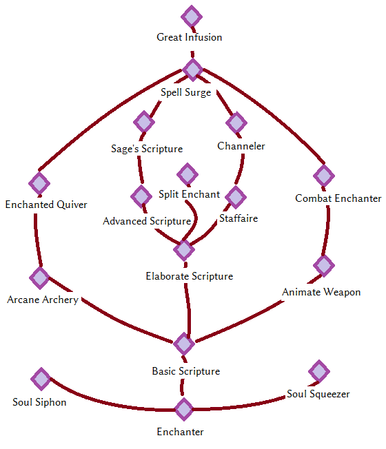

_[Home](../)_ |
_[Magic Perks](../magic)_

# Perks [Enchanting]

## Tree

## Perks

**Enchanter** _(0/50)_
1. Enchantments you create are x% stronger, where x is (0.5* ENCHANTING_SKILL). Caps out at 25% (skill level 50).
2. Enchantments you create are x% stronger, where x is (0.5* ENCHANTING_SKILL). Caps out at 50% (skill level 100).

**Basic Scripture** _(15)_
1. Can use an enchanter's quill from your inventory to craft certain scrolls of Novice and Apprentice level spells. Crafting a scroll requires ink and paper rolls. Unlocks recipe for "Enchanter's Quill". All enchantments are 4% stronger. All spells are 2% cheaper to cast.

    Enchanter's quill can be crafted at the forge.
    Ingredients for one enchanter's quill: 1 quill, 1 empty common soul gem, 2 silver ingot

**Advanced Scripture** _(30)_
1. Can use a quill from your inventory to craft certain scrolls of Adept level spells. All enchantments are 4% stronger. All spells are 2% cheaper to cast.
    Crafting a scroll requires ink and paper rolls.

**Elaborate Scripture** _(45)_
1. Can use a quill from your inventory to craft certain scrolls of Expert level spells. All enchantments are 4% stronger. All spells are 2% cheaper to cast.
    Crafting a scroll requires ink and paper rolls.

Sage's Scripture (70)
1. Can use a quill from your inventory to craft certain scrolls of Master level spells. All enchantments are 4% stronger. All spells are 2% cheaper to cast.
    Crafting a scroll requires ink and paper rolls.

**Split Enchant** _(40) (X)_
1. When activating an enchanter, you may opt to put two enchantments on one weapon or armor at 60% enchantment strength. All enchantments are 4% stronger.
    - Due to a questionable design decision, Drafting Tables from Hearthfire can be used to switch between single and dual enchanting mode

**Soul Siphon** _(25/50)_
1. Killing a non-humanoid enemy automatically traps 10% of its soul and recharges the killer's weapon with it. All enchantments are 4% stronger.
2. Killing any enemy automatically traps 15% of its soul and recharges the killer's weapon with it. All enchantments are 4% stronger.

**Soul Squeezer** _(40)_
1. Soul gems recharge weapons 50% better. All enchantments are 4% stronger.

**Arcane Archery** _(25)_
1. Grants the toggleable abilities "Arcane Archery - Great Fireball", "Arcane Archery - Thunderstrike" and "Arcane Archery - Winter's Breath". Only one of these can be active at any given time. All enchantments are 4% stronger.

    When using a bow and releasing fully drawn shots, these abilities simultaneously cause spells to emit from the archer, as long as the archer has at least 50% Magicka left. Each spell consumes 30 Magicka. Great Fireball deals 30 fire damage, Thunderstrike deals 20 shock damage within a 20 feet radius, and Winter's Breath deals 20 frost damage, as well as a 30% movement speed debuff for 3 seconds.

    "Arcane Archery" spells have their magnitude boosted by everything that boosts the magnitude of Destruction spells, but do not gain secondary effects from Destruction perks.

**Enchanted Quiver** _(40/60/80)_
1. "Arcane Archery" spells may be used as long as the user has at least 40% Magicka left. Each "Arcane Archery" spell consumes 27 Magicka. All enchantments are 4% stronger.
2. "Arcane Archery" spells may be used as long as the user has at least 30% Magicka left. Each "Arcane Archery" spell consumes 24 Magicka. All enchantments are 4% stronger.
3. "Arcane Archery" spells may be used as long as the user has at least 20% Magicka left. Each "Arcane Archery" spell consumes 21 Magicka. All enchantments are 4% stronger.

**Staffaire** _(40)_
1. Unlocks crafting recipes for staves. Staves need an empty staff of the respective school, a spell tome of the spell you want on the staff, and need you to already know the spell. (*) All enchantments are 4% stronger.

    (*) In PerMa, I distributed a few staff enchanters across Skyrim.

**Channeler** _(50/70)_
1. While a staff's charge is below 50%, it recovers by 5 every 5 seconds automatically. All enchantments are 4% stronger.
2. While a staff's charge is below 50%, it recovers by 10 every 5 seconds automatically. All enchantments are 4% stronger.

**Animate Weapon** _(35)_
1. Grants the lesser power "Animate Weapon". All enchantments are 4% stronger.

    "Animate Weapon" causes your currently equipped right-hand melee weapon to attack and move on its own for 15 seconds. It is invincible and has no combat perks or the like. Once the timer is up, the weapon returns to your inventory. Does work with two-handed melee weapons.

    If the weapon is an artifact, this ability will recharge it. If not, this ability will clear the enchantment, and restore 10% of the enchantment charge lost as Magicka.

**Combat Enchanter** _(60)_
1. If you have multiple weapons or weapon and shield equipped, "Animate Weapon" will animate both. "Animate Weapon" lasts for 25 seconds. All enchantments are 4% stronger.

**Spell Surge** _(75/90)_
1. If you have both a spell and an enchanted weapon equipped at the same time, the weapon's charge boosts the spell's duration and magnitude by a factor of x, where x is (1+(WEAPON_CHARGE*0.01)), up to a maximum of 1.1 at a charge of 1000. All enchantments are 4% stronger.
2. If you have both a spell and an enchanted weapon equipped at the same time, the weapon's charge boosts the spell's duration and magnitude by a factor of x, where x is (1+(WEAPON_CHARGE*0.01)), up to a maximum of 1.15 at a charge of 1500. If you have at least one enchanted weapon or staff equipped that has 1500 or more charge, all armor protects 15% better. All enchantments are 4% stronger.

**Focus: Great Infusion** _(95)_ (X)
1. Grants the items "Dragon Sigil - Armor" and "Dragon Sigil - Weapon", and grants the lesser power "Great Infusion". All enchantments are 10% stronger

    "Great Infusion" consumes a dragon soul upon being used, and counts as "active" for 10 minutes after doing so.

    Disenchant the items to learn the "Dragon's Roar" and "Dragon's Wings" enchantments. "Dragons Roar" can be applied to weapons and adds 10 fire, frost and shock damage each, as well as 50 points of armor reduction and 20% of magic resistance reduction each for 5 seconds.
    "Dragon's Wings" can be applied to armor and increases armor rating by 40, magic resistance by 10%, and movement and attack speed by 4%.

    Both "Dragon's Roar" and "Dragon's Wings" are only active while "Great Infusion" is active.
