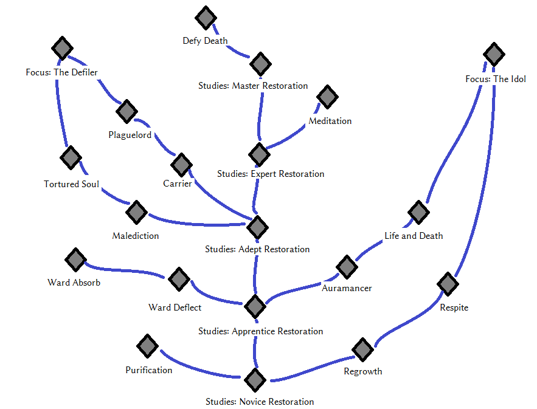

_[Home](../)_ |
_[Magic Perks](../magic)_

_[Restoration Spells](./spells/restoration.md)_

# Perks [Restoration]

## Tree

## Perks

**Studies: Novice Restoration** _(0)_
1. Grants a random novice level Restoration spell. All Restoration spells are 20% cheaper.

**Studies: Apprentice Restoration** _(30)_
1. Grants a random apprentice level Restoration spell. Standing still decreases ward spell cost by 30%. Whenever a ward absorbs a spell while standing still, recover 10 Magicka instantly.

**Studies: Adept Restoration** _(40)_
1. Grants a random adept level Restoration spell. While in combat, each hostile undead within a 15 feet radius gives 5% magic resistance and 30 armor.

**Studies: Expert Restoration** _(65)_
1. Grants a random expert level Restoration spell. Casting any non-concentration spell from any school restores 10 health instantly. This effect does not scale with anything.

**Studies: Master Restoration** _(90)_
1. Grants a random master level Restoration spell. Unlocks Restoration's "focus" perks. Casting a spell with base cost of 100 or higher increases Magicka regeneration by 100% for 1 minute. Does not stack with itself.

**Purification** _(30)_
1. Effects that require "Chastise" to be active on a target and that need certain Health percentages to trigger their strongest effect have their trigger threshold increased by 20%. For example, "Purgatory" will instantly kill and detonate the target at 60% Health or lower, instead of 40% or lower.

**Regrowth** _(20)_
1. Healing spells sre 25% stronger and may be dual cast to further increase their magnitude.

**Respite** _(55)_
1. Healing spells additionally recover Stamina by 50% of their magnitude.

**Auramancer** _(30/50)_
1. Aura range is increased by 35%
2. Aura range is increased by 70%

**Life and Death** _(50/80)_
1. In addition to any other scaling bonuses, damaging auras get x% stronger, where x is your Restoration skill level.
2. In addition to any other scaling bonuses, damaging auras get x% stronger, where x is your Restoration skill level and your Destruction skill level combined.

**Ward Deflect** _(30/45)_
1. While having a ward spell up, take 20% less damage from ranged weapon attacks. Makes "Spell Ward" grant 50 armor while equipped and another 50 while being used
2. While having a ward spell up, take 35% less damage from ranged weapon attacks. Makes "Spell Ward" grant 75 armor while equipped and another 75 while being used, and unlocks timed blocking for "Spell Ward".

**Ward Absorb** _(50)_
1. Blocking a spell with a ward will recover your Magicka by 20% of all Magicka that hits them. Lets "Spell Ward" absorb shouts properly. 

**Abnegation** _(40)_
1. Fire, frost and shock spells don't harm entities not hostile to the player.

**Guidance of the Nine** _(65)_
1. Daedric material weapons and artifacts deal 90% less damage. Daedric armor protects 90% worse. Divine blessings are three times as strong. While under the effect of a blessing, heal spells and buff spells are 15% stronger.

**Carrier** _(45/65)_
1. Plague spread range is increased from roughly 10 feet to roughly 20 feet. Plagues can be dual cast for a 50% boost in spread range. Take 5% less damage from enemies affected by plagues.
2. Plague spread range is increased from roughly 20 feet to roughly 30 feet. Plagues can be dual cast for a 50% boost in spread range. Take 10% less damage from enemies affected by plagues.

**Plaguelord** _(50/80)_
1. Plagues will attempt to infect a new target every 2 seconds, instead of every 3 seconds. (*)
2. Plagues will attempt to infect a new target every second, instead of every 1 seconds. (*)

    (*) Plagues spread from the initial target to adjacent targets. They do not spread from secondary targets. Plagues will not reinfect the initial target.

**Malediction** _(50/75)_
1. Curse spread radius grows from roughly 10 feet to roughly 20 feet. Curses will try to find a new target twice if an old target dies while the curse is active. (*)
2. Curse spread radius grows from roughly 20 feet to roughly 30 feet. Curses will try to find a new target three times if an old target dies while the curse is active. (*)

    (*) When the old target dies, a curse will randomly select a new target within its spread radius. If the target fulfills a few conditions (not the player, has base actor, not NONE), the curse jumps over. If this check fails, the curse will either try again or stop of the maximum number of attempts is reached.

**Tortured Soul** _(70)_
1. Spells that would normally be restricted to undead targets now also work on targets affected by curses.

**Meditation** _(70/80)_
1. While your Health is below 40%, Restoration spells are 15% cheaper to cast. While your Health is below 20%, this bonus increases to 25%.
2. While your Health is below 40%, Restoration spells are 25% cheaper to cast. While your Health is below 20%, this bonus increases to 35%.

**Defy Death** _(95)_
1. If your Health drops below 50%, health regeneration is increased by 50%. If your Health drops below 25%, this bonus increases to 100%. Once per day, dropping below 10% Health causes you to automatically recover 250 Health.

**Focus: The Idol** _(95)_
1. Healing spells are 20% stronger. Auras are free to toggle. Removes the Health and Stamina debuffs from auras.

    Grants the spell _Aura - Aspect of Brilliance_.

    _Aura - Aspect of Brilliance_ is the only Aura that affects both enemies and allies. Allies deal 15% more damage with Destruction spells and any weapon, while enemies deals 15% less damage with Destruction spells and any weapon.

**Focus: The Defiler** _(95)_
1. Deal 10% more weapon damage against targets affected by curses or plagues. Curses and plagues are 25% cheaper to cast.

    Grants the spell _Curse of Binding_.

    _Curse of Binding_ is a curse that may only affect enemies that already are affected by a plague. As long as a target affected by _Curse of Binding_ is alive, this spell's caster is immune to any damage, but any spell cast is 50% more expensive.

## TODO
- "no friendly fire" perk restoration
