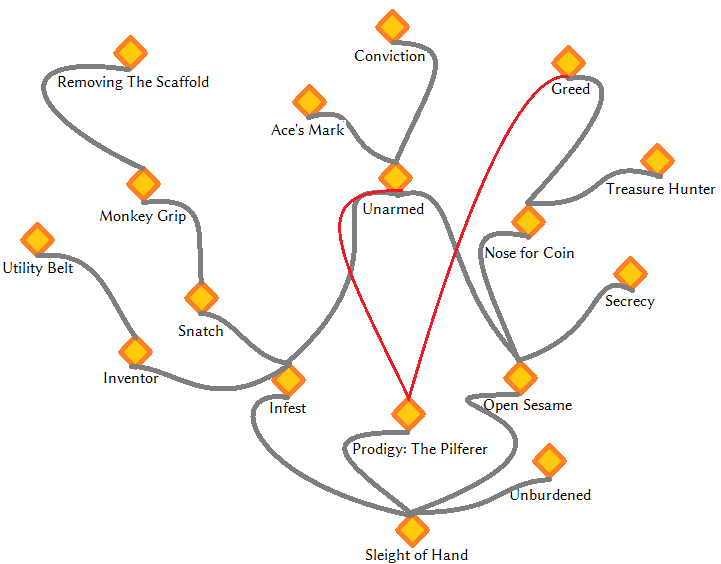

_[Home](../)_ |
_[Thief Perks](../thief)_

# Perks [Dexterity]

## Tree

## Perks

**Sleight of Hand** _(0/40)_
1. Picking pockets is 10% easier. When picking locks, start within 45 degrees of the sweet spot.
1. Picking pockets is 30% easier. When picking locks, start within 25 degrees of the sweet spot.

**Prodigy: The Pilferer** _(20)_
1. Instantly grants **Greed** and **Unarmed**

**Unburdened** _(25/55)_
1. Maximum carry weight is increased by 50.
2. Maximum carry weight is increased by 100. Various **clutter** items have their weight reduced by 50%. This covers a lot of stuff, including ingots, ore, pelts, dwarven scraps, goblets, and more.

**Infest** _(25)_
1. Inverse-pickpocket a poison or adhesive explosive to trigger it at the target.

**Inventor** _(30/45/60)_
1. Unlocks recipes for **Finger Trap** and **Semiconductive Device** at the forge.

    When a **Finger Trap** is placed on a NPC via reverse pickpocketing, the NPC hs a 30% chancer to be staggered once he starts attacking. If this effect kicks in, the **Finger Trap** has a 50% chance to break.

    When placed on a dwemer machine via reverse pickpocketing, the **Semiconductive Device** completely disables the device for 10 seconds once it starts moving, and is consumed in the process.

    * Recipe for 1 **Finger Trap**: 1 lockpick, 1 leather strip, 1 steel ingot
    * Recipe for 1 **Semiconductive Device**: 1 iron ingot, 1 void salts

2. Unlocks recipe for **Tripwire Bond** at the tanning rack. Unlocks recipe for **Spike Powder** at the forge.

    When a **Tripwire Bond** is placed on a NPC via reverse pickpocketing, the NPC will stumble as soon as he starts moving. Has a 70% chance of breaking when this effect kicks in.

    Whenever the NPC with spike powder in his inventory initiates an attack, he loses 5% of his current Health. The placed spike powder is consumed as soon as the first attack is initiated. Note that a single **Spike Powder** lasts until the target dies.

    * Recipe for 1 **Tripwire Bond**: 1 linen wrap, 2 leather strip
    * Recipe for 1 **Spike Powder**: 1 iron ingot, 1 bone meal

3. Unlocks recipes for **Spellbomb** and **Oil Container** at the forge.

    When a **Spellbomb** is placed on a NPC via reverse pickpicketing, the NPC will be struck to the ground and lose half of his current Magicka as soon as he casts a spell. Consumed when triggered.

    As soon as an **Oil Container** is placed on a NPC via reverse pickpocketing, the NPC will continuously leave oil puddles behind. Oil puddles explode when hit with fire. If the NPC dies, the effect finishes. If the NPC is hit with a fire spell or explosion, the effect terminates and causes an instant explosion. Consumed instantly when placed.

    * Recipe for 1 **Spellbomb**: 1 lesser or common soul gem, 1 ale, 1 torch
    * Recipe for 1 **Oil Container**: 1 empty wine bottle, 2 dwarven oil

    Rules for all "Inventor" gagdets: Applying multiple ones of one type does not "stack". Adding five Finger Traps will only count as one when determinig the stagger chance.  If one finger trap breaks, the remaining ones will not have any effect. You may collect them again and use them on another target.

    However, multiple different gadgets placed on one actor do stack.

**Utility Belt** _(40)_
1. **Inventor** gadgets, traps, lockpicks and potions/poisons found in the world are weightless. Also includes "fixed value" potions crafted from Alchemy via perks such as **Poison Burst** and the Camouflage Tincture from Wayfarer.

**Snatch** _(40)_
1. Timed blocking with a fist weapon and no shield equipped steals the attacker's weapon instantly, with no additional crime being commited.

**Monkey Grip** _(60)_
1. Attacking a blocking target that carries a shield with a fist weapon steals the target' shield with no additional crime being commited.

**Removing the Scaffold** _(80)_
1. Attacking a target that carries armor with a fist weapon will steal a piece of the target's armor with no additional crime being commited if the target did not block the attack. Can not steal shields.

Armor theft priority: armguards >> helmet >> legguards >> cuirass

**Open Sesame** _(30)_
1. Creates a key for every lock you pick that has a key. Makes stealing keys 80% easier.

**Secrecy** _(45)_
1. Picking locks does not count as crime.

**Nose for Coin** _(35/50)_
1. Find more gold in chests
2. Find more gold in chests and on people. For each person, the amount of additional gold found is determined by three dice rolls with numbers between 1 and 100 that are summed up. Additionally, each "7" rolled nets another 777 gold.

**Greed** _(40)_
1. Gold has no weight

**Treasure Hunter** _(45/60)_
1. Chance to find special treasuere in chests becomes 5% per roll.
2. Chance to find special treasuere in chests becomes 10% per roll. Goods you steal are automatically laundered, and thus not taken from you if you end up getting caught.

**Unarmed** _(55)_
1. Can steal equipped weapon via Pickpocket.

**Ace's Mark** _(80)_
1. Can steal worn armor from targets via Pickpocket.

**Conviction** _(95)_
- Allows pickpocketing chance to reach 100%
