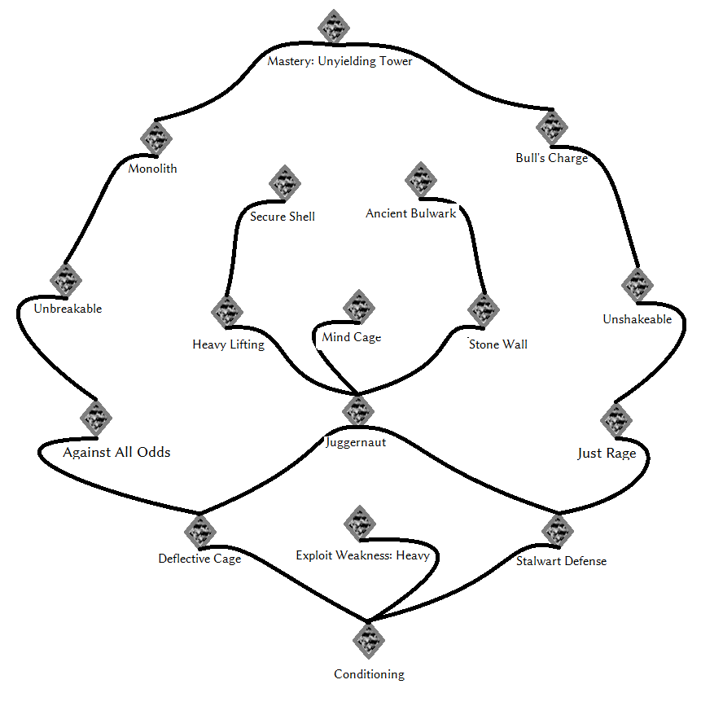

_[Home](../)_ |
_[Warrior Perks](../warrior)_

# Perks [Heavy Armor]

## Tree

## Perks

**Conditioning** _(0/30/60)_
1. Worn heavy armor is 20% lighter.
2. Worn heavy armor is 25% lighter. Negate movement speed penalty from heavy cuirass.
3. Worn heavy armor is 30% lighter. Negate movement speed penalty from heavy cuirass and attack speed penalty from heavy gauntlets.

**Exploit Weakness: Heavy** _(30)_
1. Against enemies wearing at least one piece of heavy armor and no light armor, ignore 20% armor and deal 10% more weapon damage.

**Deflective Cage** _(20/35)_
1. While wearing Heavy arm, head, chest, and leg armor, incoming shock magic is 20% weaker. Works on top of magic resistance.
2. While wearing Heavy arm, head, chest, and leg armor, incoming shock magic is 25% weaker, and all incoming hits from bladed and piercing weapons are 10% weaker. Works on top of magic resistance and armor value.

**Against All Odds** _(40/55)_
1. While wearing Heavy arm, head, chest, and leg armor, each enemy within 8 feet range increases your armor rating by 40.
2. While wearing Heavy arm, head, chest, and leg armor, each enemy within 16 feet range increases your armor rating by 40.

**Unbreakable** _(60)_
1. While wearing Heavy arm, head, chest, and leg armor, negate the effect of any enemy perk that reduces armor.

**Monolith** _(80)_
1. While wearing Heavy arm, head, chest, and leg armor, incoming unblocked hits stagger the attacker.

**Stalwart Defense** _(20/35)_
1. While wearing Heavy arm, head, chest, leg armor and shield, incoming power attacks are 30% weaker.
2. While wearing Heavy arm, head, chest, and leg armor incoming power attacks are 50% weaker.

**Just Rage** _(40/55) (X)_
1. While wearing Heavy arm, head, chest, and leg armor and while your Health is below 30%, time slows down by 10% and melee attacks are 10% stronger.
2. While wearing Heavy arm, head, chest, and leg armor and while your Health is below 45%, time slows down by 10% and melee attacks and Destruction spells are 10% stronger.

**Unshakeable** _(60)_
1. While wearing Heavy arm, head, chest, and leg armor, negate incoming stagger.

**Bull's Charge** _(80)_
1. While wearing Heavy arm, head, chest, and leg armor and while not blocking, run into enemies to strike them down. Does not work on ghosts, dragons and giants.

**Stone Wall** _(30)_
1. While blocking with a heavy shield, incoming Destruction spell magnitude is decreased by 10%. Works on top of magic resistance. Negate movement speed malus from heavy shields.

**Ancient Bulwark** _(50)_
1. While blocking with a heavy shield, incoming shout magnitude is decreased by 50%. Works on top of magic resistance. Negate attack speed malus from heavy shields.

**Heavy Lifting** _(40/75)_
1. While wearing heavy gauntlets, power attacks are 15% stronger.
1. While wearing heavy gauntlets, power attacks are 20% stronger and cost 10% less Stamina.

**Juggernaut** _(40/75)_
1. While wearing heavy legguards and moving, all melee attacks are 8% stronger.
2. While wearing heavy legguards and moving, all melee attacks are 15% stronger.

**Secure Shell** _(65)_
1. While wearing a heavy cuirass, bleed and debuff rank of incoming attacks is reduced by 1.

**Mind Cage** _(65)_
1. If you're using PerMa_Thief as well, negates spellcasting malus from heavy armor. While wearing a heavy armor helmet, incoming spells increase your magic resistance by 20% for 4 seconds. Does not stack with itself.

**Mastery: Unyielding Tower** _(95)_
1. Grants toggleable ability **Unyielding Tower**. While active, move 30% slower, and all incoming weapon and spell damage is  reduced by 50%. May be toggled on a total of 4 times after resting.
