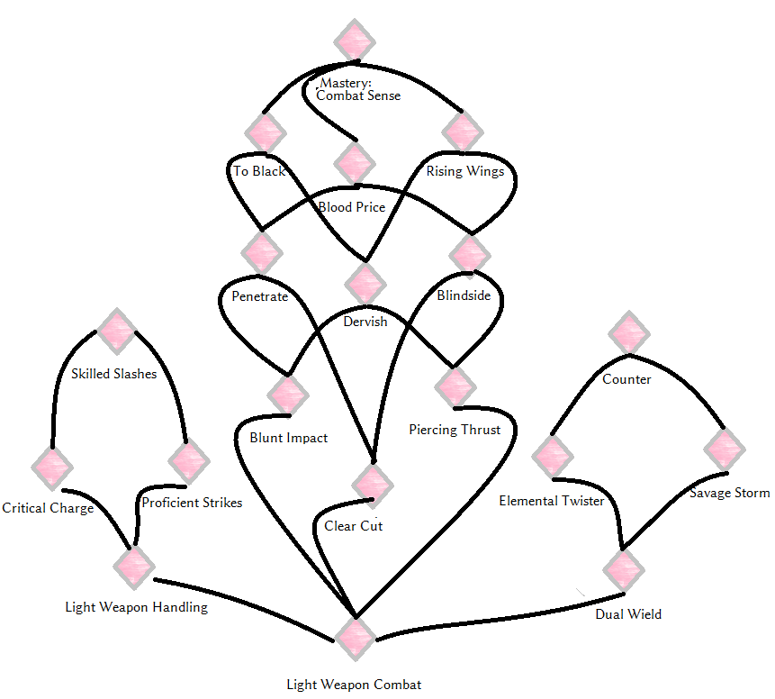

_[Home](../)_ |
_[Warrior Perks](../warrior)_

# Perks [Light Weaponry]

## Tree

## Perks

**Light Weapon Combat** _(0/40)_
1. Weapons covered by _Light Weaponry_ deal 15% more damage. Weapons covered by "Heavy Weaponry" deal 5% more damage.
2. Weapons covered by _Light Weaponry_ deal 35% more damage. Weapons covered by "Heavy Weaponry" deal 15% more damage.

**Blunt Impact** _(25/50)_
1. Sideways power attacks with blunt weapons disorient the target for 10 seconds.
2. Sideways power attacks with blunt weapons disorient the target for 20 seconds.

    [COMBAT HIT SPELL priority 1]

    Weapon attacks performed by disoriented targets have a 30% chance to deal 10% damage only.

**Clear Cut** _(25/50)_
1. Critical hit chance for blades is increased by 5%, critical hit damage for blades is increased by 40%.
2. Critical hit chance for blades is increased by 10%, critical hit damage for blades is increased by 80%.

**Piercing Thrust** _(25/50)_
1. Piercing Weapons ignore 35% armor against targets that don't have a heavy cuirass or shield equipped.
2. Piercing Weapons ignore 50% armor against targets that don't have a heavy cuirass equipped.

**Blindside** _(45/65)_
1. Piercing and blade weapons covered by _Light Weaponry_ deal 25% more damage when attacking the enemy's back within a 80 degree angle.
2. Piercing and blade weapons covered by _Light Weaponry_ deal 35% more damage when attacking the enemy's back within a 120 degree angle.

**Penetrate** _(60)_
1. Blocked power attacks with piercing and blunt weapons covered by _Light Weaponry_ reduce the target's armor values by 200 for 5 seconds.

**Dervish** _(60)_
1. Piercing and blunt weapons covered by _Light Weaponry_ cause the attack target to fall to the ground, if they land a regular (non-power attack) hit while the target is attacking.

    [COMBAT HIT SPELL priority 2]

**Blood Price** _(80)_
1. Piercing weapons covered by _Light Weaponry_ deal 30% more damage against bleeding targets. The bleed rank of all piercing weapons covered by _Light Weaponry_ increases by 1.

**To Black** _(80)_
1. Forward power attacks with blunt weapons covered by _Light Weaponry_ strike any target not wearing heavy or light head armor down. If the target is wearing head armor, it is instead disoriented for 60 seconds. Only works while the attacker's stamina is above 50%.

    [COMBAT HIT SPELL priority 1]

**Rising Wings** _(80)_
1. Unblocked regular attacks with blade weapons covered by _Light Weaponry_ increase your attack and movement speed by 3% for 4 seconds. Stacks with itself.

**Mastery: Combat Sense** _(95)_
1. Ability that automatically activates once hitting someone with a weapon, once every 60 seconds. Lasts 10 seconds. When active, time is slowed down by 25% and and movement speed is increased by 25%.

**Light Weapon Handling** _(20)_
1. Power attacks with weapons covered by _Light Weaponry_ consume 20% less Stamina. Unlocks "decapitation" kill moves.

**Critical Charge** _(25)_
1. Unlocks running power attack for weapons covered by _Light Weaponry_. Running power attacks gain a 100% chance to cause a critical hit with +50% critical damage.

**Proficient Strikes** _(30)_
1. When performing power attacks, the debuff rank of any weapon covered by _Light Weaponry_ is increased by 1.

**Skilled Slashes** _(45)_
1. When performing power attacks, the bleed rank of any weapon covered by _Light Weaponry_ is increased by 1.

**Dual Wield** _(20/40)_
1. Negates damage malus for dual wielding. (*)
2. Increases attack speed and damage while dual wielding by 10%.

    (*) In PerMa, dual wielding without this perk reduces damage by 30%.

**Elemental Twister** _(35)_
1. While dual wielding, sttack speed is increased by 5% and fire, frost and shock damage is increased by 25%.

**Savage Storm** _(55)_
1. While dual wielding, standing power attacks hit all targets in front of you.

**Counter** _(70)_
1. While dual wielding, initiating an attack makes you invulnerable to weapon damage for 0.4 seconds.
