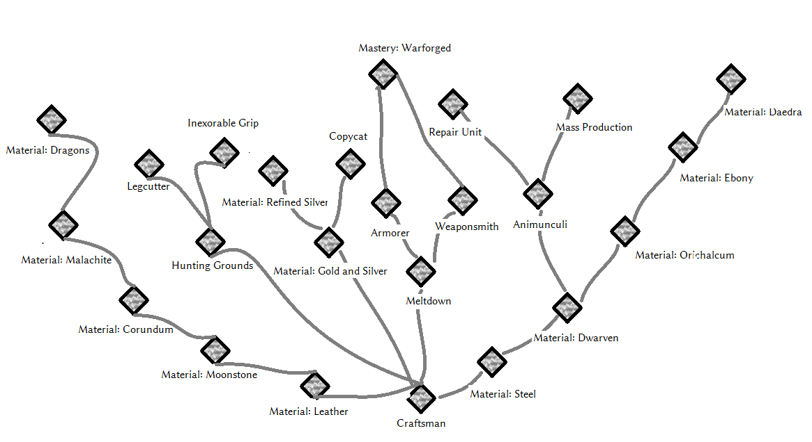

_[Home](../)_ |
_[Warrior Perks](../warrior)_

# Perks [Smithing]

## Tree

## Perks

**Craftsman** _(0/50)_
1. Tempering is 25% better.
2. Tempering is x% better, where x is SMITHING_SKILL * 0.5.

**Material: Leather** _(20)_
1. Unlocks leather armor crafting and tempering recipes. While wearing full leather armor, gain 15% fire and frost resistance.

**Material: Moonstone** _(35)_
1. Unlocks moonstone armor and weapon crafting and tempering recipes. While wearing full moonstone armor, all spells are 5% cheaper to cast.

**Material: Corundum** _(50)_
1. Unlocks corundum armor and weapon crafting and tempering recipes. While wearing full corundum armor, Health and Stamina regenerate 20% faster.

**Material: Malachite** _(70)_
1. Unlocks malachite armor and weapon crafting and tempering recipes. While wearing full malachite armor, 10% of all incoming spells are absorbed.

**Material: Dragons** _(90)_
1. Unlocks dragonbone and dragonscale armor and weapon crafting and tempering recipes. While wearing full dragonplate or dragonscale armor, move 5% faster and deal 10% more damage with frost and fire.

**Material: Steel** _(20)_
1. Unlocks steel armor and weapon crafting and tempering recipes. While wearing full steel armor, incoming bow damage is reduced by 10%, and incoming crossbow damage is reduced by 20%.

**Material: Dwarven Metal** _(35)_
1. Unlocks dwarven metal armor and weapon crafting and tempering recipes. While wearing full dwarven armor, take 15% less damage from Falmer and dwemer machines.

**Material: Orichalcum** _(50)_
1. Unlocks orichalcum armor and weapon crafting and tempering recipes. While wearing full orichalcum armor, orichalcum weapons deal 15% more damage.

**Material: Ebony** _(70)_
1. Unlocks ebony armor and weapon crafting and tempering recipes. While wearing full ebony armor, magic resistance is increased by 10%.

**Material: Daedra** _(90)_
1. Unlocks daedric armor and weapon crafting and tempering . While wearing full daedric armor, incoming blae weapon attacks 10% armor and daedra summoning spells last 25% longer.

**Material: Gold and Silver** _(30)_
1. Unlocks crafting and tempering recipes for silver weapons and various jewelry.

**Material: Refined Silver** _(45)_
1. Unlocks crafting and tempering recipes for refined silver weapons.

**Copycat** _(55) (X)_
1. Unlocks various crafting recipes for "Artifact Essence" and for unenchanted copies of various daedric artifacts you have in your inventory.

    "Artifact Essence" is crafted at the smelter and requires a Daedra Heart and three soul gem fragments of one of
    various combinations. Its sole use lies in the creation of artifact replicas. Crafting recipes for "Artifact
    Essence" only show up if you have a Daedra Heart in your inventory.

    Daedric artifact replicas require one Artifact Essence as well as three pieces of the material you'd use
    when tempering the artifact to be crafted. The recipes only show up if you have the original artifact in
    your inventory.

**Meltdown** _(25) (X)_
1. Unlocks meltdown recipes for all armor and weapons whose material perk you have at the smelter (metal) or tanning rack (leather/clothing)

**Armorer** _(40) (X)_
1. Can re-forge any craftable armor whose material perk you have into a more lightweight version with slightly better stats.

    Reforged armor has -30% weight and +15% armor value.

**Weaponsmith** _(40) (X)_
1. Can re-forge any craftable weapon whose material perk you have into a more
    lightweight version with slightly better stats.

    Reforged weapons have -30% weight, +10% attack speed and +10% damage.

    Reforging takes place at the forge and requires two units of the ingredient you'd need
    when tempering the weapon. Reforging recipes don't show up unless you actually
    have a reforgable weapon in your inventory.

**Animunculi** _(35/55/80) (X)_
1. Unlocks crafting recipe for **Container - Dwarven Spider**.

    Ingredients: 1 lesser soul gem, 2 dwarven cogs, 2 dwarven oil, 3 dwarven metal ingot

2. Unlocks crafting recipes for **Container - Dwarven Sphere** and **Container - Dwarven Ballista**.

    Ingredients **Container - Dwarven Sphere**: 1 common soul gem, 2 dwarven cogs, 3 dwarven oil, 4 dwarven metal ingot

    Ingredients **Container - Dwarven Ballista**: 1 common soul gem, 4 dwarven cogs, 1 Large Dwemer Strut, 4 dwarven metal ingot

3. Unlocks crafting recipes for **Container - Frost Centurion**, **Container - Fire Centurion**
    and **Container - Steam Centurion**.

    Ingredients **Container - Frost Centurion**: 1 grand soul gem, 1 dwarven centurion core, 3 frost salt, 12 dwarven metal ingot

    Ingredients **Container - Fire Centurion**: 1 grand soul gem, 1 dwarven centurion core, 4 fire salt, 12 dwarven metal ingot

    Ingredients **Container - Steam Centurion**: 1 grand soul gem, 1 dwarven centurion core, 6 dwarven gyro, 12 dwarven metal ingot

    When dropped from the inventory, these items spawn a permanent Dwarven companion. When activated, you can collect the companion again again.

**Mass Prodution** _(70) (X)_
1. Reduces the weight of all "Container" items by 80%.

**Repair Unit** _(45) (X)_
1. Unlocks recipe for "**Container - Dwarven Medi Spider**". Dwarven Medi Spiders are bulkier and larger than regular Dwarven Spiders, and heal mechanical allies automatically while they're nearby.

**Hunting Grounds** _(30/55) (X)_
1. Unlocks **Bear Trap** crafting recipe at forges. Grants lesser power **Place Trap**.

    **Place Trap** opens up a menu that allows you to select a trap to be placed at the point you aimed at. Has a range of 10 feet. If you prefer to manually place traps by droping them from your inventory - that's still possible.

2. Unlocks **Spikes** crafting recipe at forges.
    Spikes can be triggered multiple times, but they cannot be collected again after they were placed.

    Bear trap base damage is 60. Spikes base damage is 30.
    Both traps' damage is affected by the target's armor value.

**Inexorable Grip** _(40/70)_
1. Physical trap damage is increased by 40%.
2. Physical trap damage is increased by 80%.

**Legcutter** _(70)_
1. Physical trap damage ignores the target's armor rating.

**Mastery: Warforged** _(50)_
1. Allows you to craft reforged gear into warforged gear at the forge. Warforged gear has considerably better stats than gear, but can not be enchanted. While using a warforged weapon, attacks consume no stamina. While wearing at least four pieces of warforged armor of any material combination, you gain all armor bonuses from all material perks you know.
